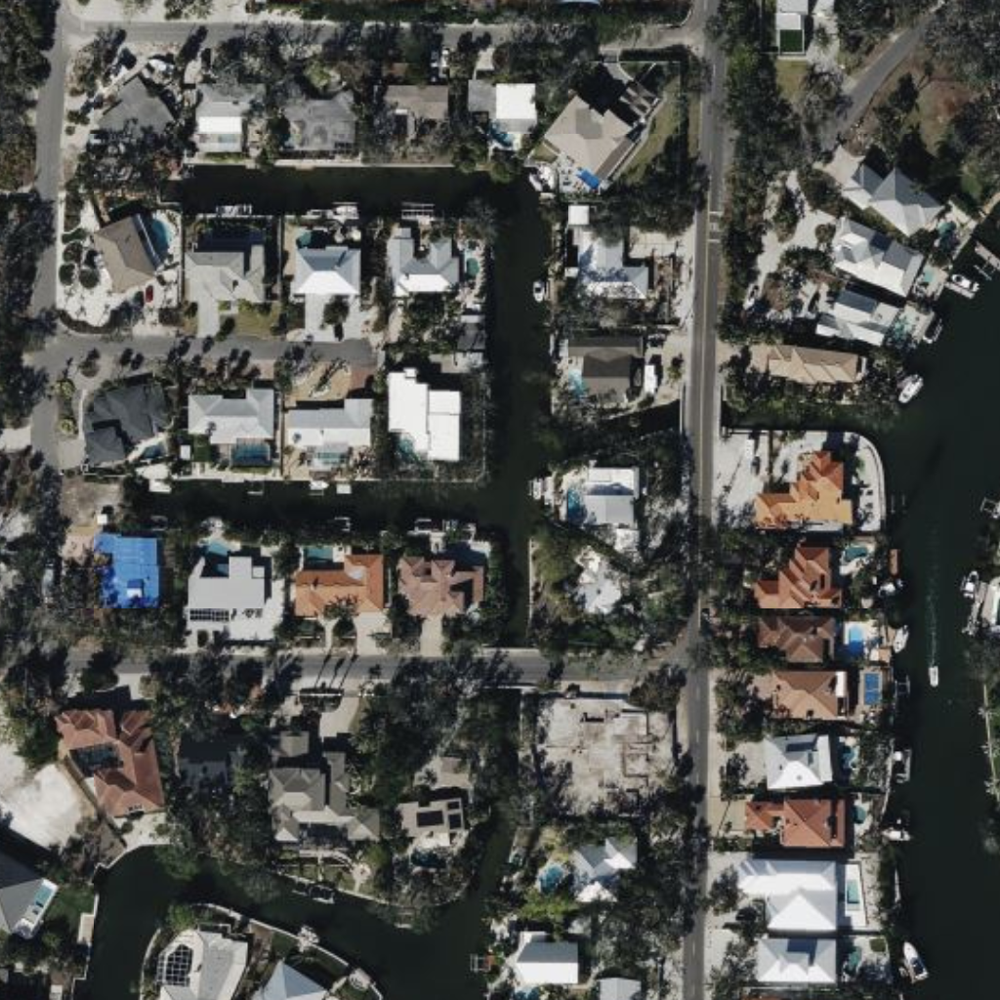
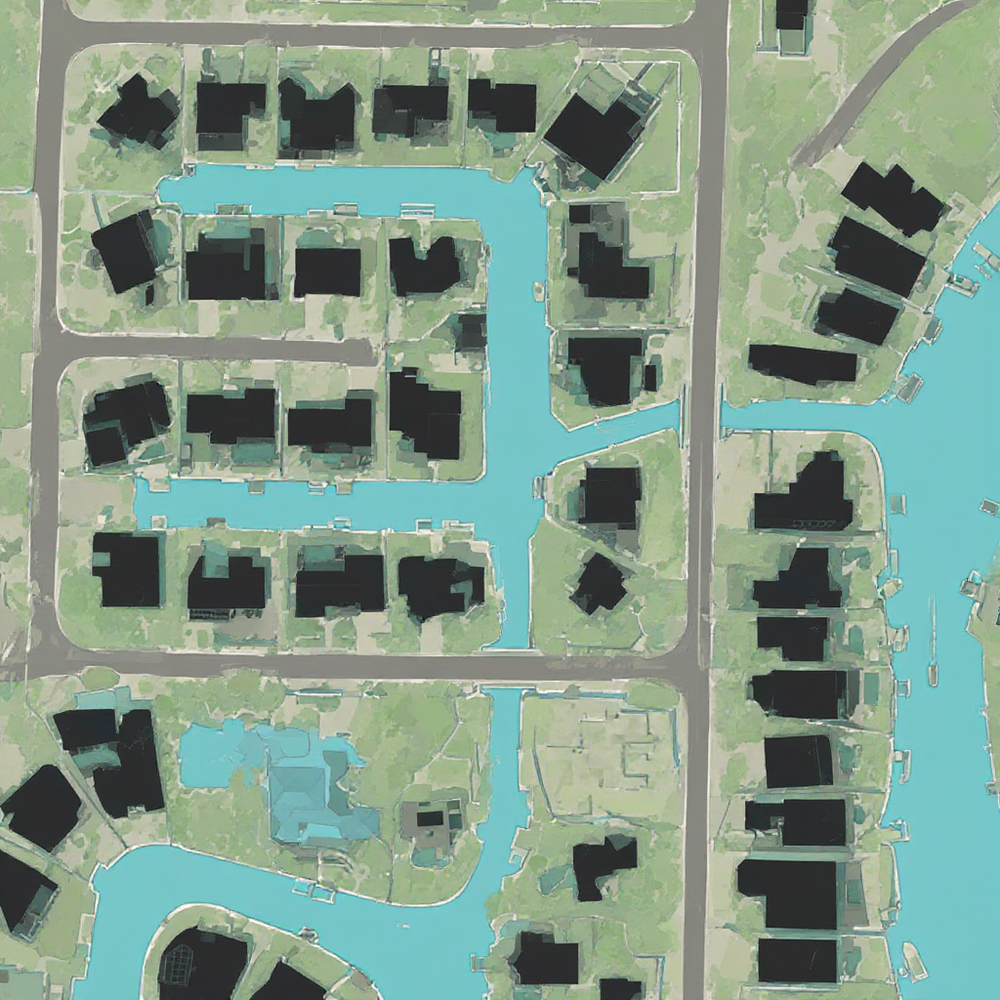

# QGIS FLUX AI Toolbox

Turn your current QGIS canvas into a high-contrast land-cover rendering with a single
Processing algorithm. The plugin captures the visible map, sends it to FLUX.1 Kontext or
FLUX 1.1 [pro] Ultra, and loads the returned PNG back into your project with proper
georeferencing. The default prompt emphasises buildings, roads, vegetation, soil, and
water—perfect for quick site analysis or presentation graphics.


## From image to map in less than 10 seconds
Have you ever looked at high resolution satellite imagery and wondered, how to turn the
information into map? 

| Input Canvas (Bing Satellite) | Default output (FLUX.1 Kontext) |
| --- | --- |
|  |  |

The default prompt is tuned for urban domains: buildings become crisp black solids, roads
and rails pop as white lines, open green turns solid emerald, soil is pale yellow, and
water bodies shine in blue. Use natural-language tweaks to pivot toward other thematic
topics whenever you need to highlight different classes.

- **Semantic look** – Lightweight land-cover classifier (a.k.a. thematic rendering, urban fabric maps,
  geo-semantic styling, contextual land-use depiction, or automated cartographic shading).
- **Source agnostic** – Ingests satellite, aerial or drone imagery as basemaps. Everything
  you see on your canvas is  forwarded to the AI model.
- **Clean UX** – Only API Key + Prompt are required. Advanced options available.

## Usage


The full matrix of embeded parameters is in [`docs/flux_models.md`](docs/flux_models.md). Please also see the official BFL docs for [FLUX 1 Kontext](https://docs.bfl.ai/kontext/kontext_image_editing#flux-1-kontext-image-editing-parameters) and 
[FLUX 1.1 Ultra](https://docs.bfl.ai/flux/flux_pro#flux-11-ultra) for further details.


## Quickstart

1. **Install the plugin**
   ```bash
   rm -rf ~/Library/Application\ Support/QGIS/QGIS3/profiles/default/python/plugins/qgis_flux/
   cp -r /Users/jstaab/Desktop/qgis_flux \
         ~/Library/Application\ Support/QGIS/QGIS3/profiles/default/python/plugins/
   ```
   Then restart QGIS and enable *AI Toolbox* under **Plugins → Manage and Install…**

2. **Grab an API key** from <https://api.bfl.ai/> (needs FLUX pro credit). Paste it into
   the Processing dialog every time or store it via the QGIS **Favorites** feature.

3. **Open the Processing Toolbox → FLUX AI Processing** and pick either *FLUX.1 Kontext*
   or *FLUX 1.1 Ultra* (Experimental!). Leave the default prompt in place for semantic 
   segmentation or tweak it to your needs. Hit **Run**.

After a few seconds of processing, the layer loads automatically under an “AI Results” group.


## Troubleshooting

- **401 / API errors** – make sure your key is valid and you have enough credits.
- **Timeout / Failed** – rerun later or reduce the tile size. Check the generated log in
  your output directory.
- **Nothing shows up** – ensure at least one layer is visible on the canvas; the plugin
  renders what you currently see.

> Note: The software comes without warranty. It serves as interface between QGIS and Black Forest Labs. It is not responsible for the models output. The user is responsible for the image rights attached to the map canvas. 
> AI generated results may be wrong. 


## Support & contact

- Author: Jeroen Staab – email@jstaab.de
- Issues / feature requests: <https://github.com/georoen/qgis-flux>

Tag your renders with **#qgisflux** so we can see what you build!
