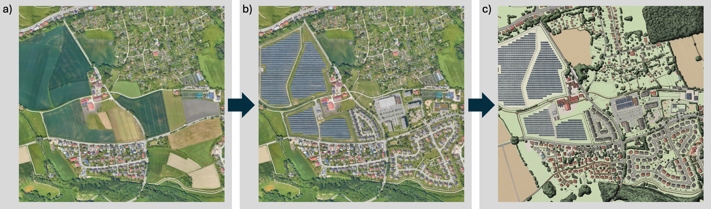
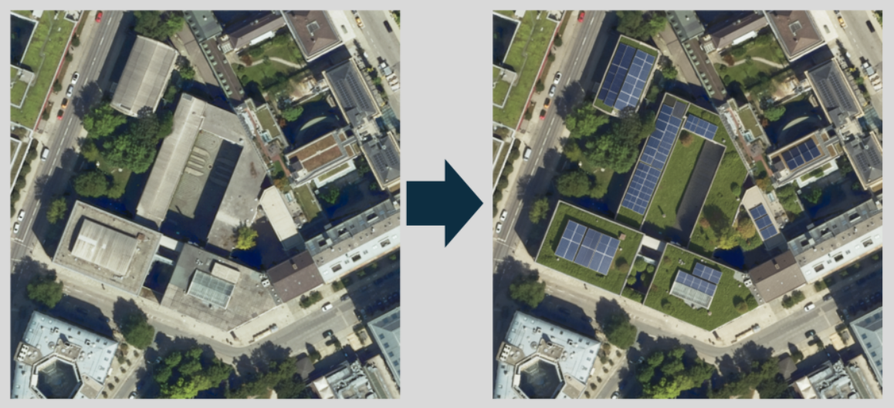
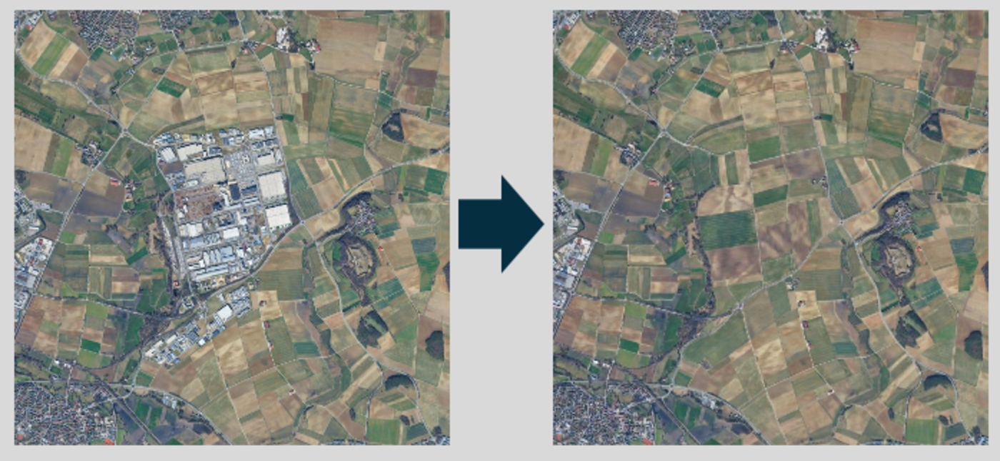
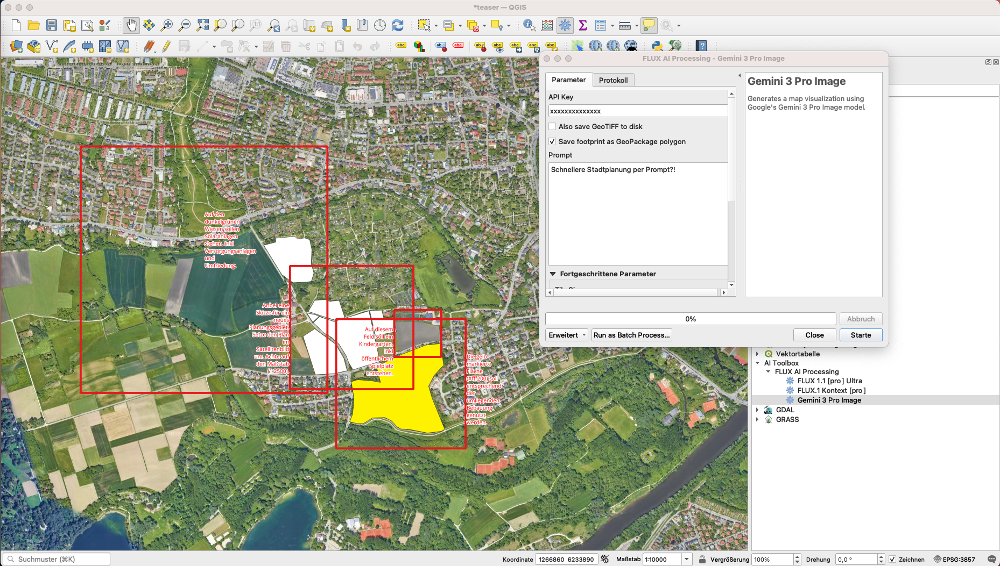
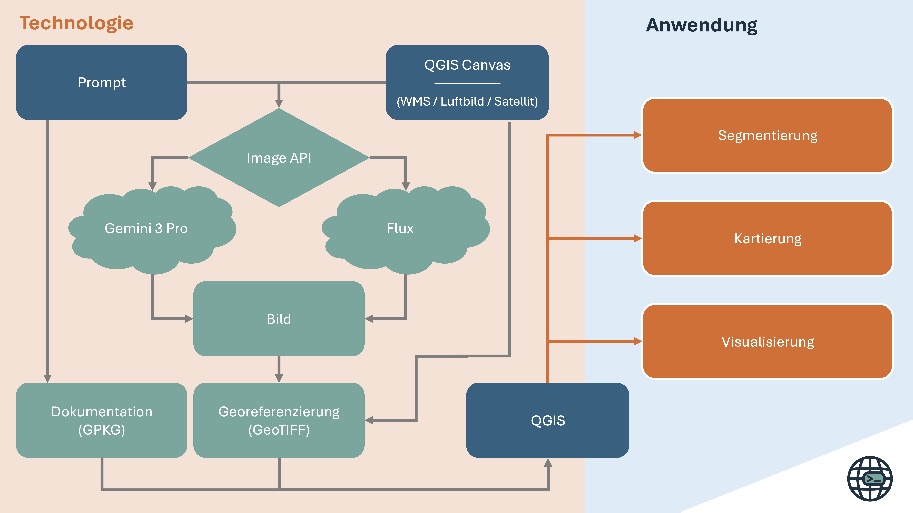

# PromptMap -- Open, Multi-Provider AI Cartography for QGIS

**PromptMap** is a QGIS Processing plugin that connects your live map canvas to generative AI image APIs. Built on an open, provider-agnostic architecture, it gives you complete control over your AI workflows, data, and costs.



**Capture what you see, write a prompt in plain language, and receive a georeferenced GeoTIFF layer back — in seconds.**

Ready to try it? → [Jump to Quickstart](#quickstart). Need help with geodata sourcing, prompt design, or workflow integration? [Book a consultation](https://meet.jstaab.de) 

## Use-Cases
Manipulating your map canvas using natural language prompts is versatile. From urban planning, image segmentation, and scientific applications.

Overall, the applications group into three modes -- Segmentation, Mapping, and Synthetic Aerial Imagery.

### 1 — Segmentation & Detection

Isolate thematic features — construction sites, vegetation, water bodies — directly from satellite or aerial imagery. The AI understands spatial context and returns a clean, color-coded mask that can be post-processed into vector polygons.


```
PROMPT: Finde die Baustelle im Bild. Markiere die Flächen in rot (#FF0000) und den übrigen Bildkontext in weiß (#000000).
```


### 2 — Cartographic Abstraction

Turn raw imagery into a presentation-ready thematic map. Buildings become crisp black solids, roads pop as white lines, green areas turn solid emerald. Adjust the prompt to match your thematic focus.


```
PROMPT: Based on the provided satellite image, generate a stylized and accurate outline map. Represent buildings as solid dark or black shapes with clean edges, roads as thin white lines or paths, and green areas (parks, lawns, vegetation) as solid green color blocks. Maintain realistic scale and proportions, and preserve the layout and spatial relationships from the satellite image. The overall composition should be minimal, clean, and suitable for urban or architectural site analysis — top-down view, flat graphic style, high contrast, and presentation-ready.
```


### 3 — Synthetic Aerial Imagery

Visualise planning scenarios as photorealistic aerial views — add green roofs and PV panels, insert new buildings, remove existing structures, or replace land use. The output is georeferenced and can be fed back into the next iteration.



```
PROMPT: Begrüne die Flachdächer der Gebäude. und platziere Solaranlagen auf den übrigen, schrägen Dächern
```


```
PROMPT: Im Kontext von Raumplanung sollen die dunkelgrüne Ackerfläche durch eine Einfamilienhausbebauung im gleichen Stil wie der Rest des Bildes gefüllt werden.  Im Notfall bitte auch bereits bestehende Häuser entfernen, um diese Siedlung an die bereits existierende Straße anzubinden
```



```
PROMPT: Für ein Stadtplanungsprojekt brauche ich eine photorealistische Darstellung. Bitte entferne das Shoppingcenter zentral im Bild. Füge stattdessen Landwirtschaftliche Flurstücke ein, wie sie in der Umgebung bereits vorkommen.
```

**Prompt Quality:** For demonstration purpose, above prompts are very short. Howver, run experiments showed that there's a relationship bewteen input quality and recieved results. Check [prompt template](#text-prompt) below for details.

**Note on realism:** AI-generated aerial images can look very convincing. Always label AI-generated imagery clearly before sharing or publishing. Therefore, by default, every output is permanently watermarked with the PromptMap logo. As this is open source software, however, you are free to [change the watermark](docs/watermark.png) yourself.


## Quickstart

1. **Install the plugin**  
   Download the ZIP from GitHub.  
   Open **QGIS → Plugins → Manage and Install… → Install from ZIP**, then enable **PromptMap**.  
   See [docs/install_ZIP.png](docs/install_ZIP.png) for a visual guide.

2. **Get an API key**
   PromptMap connects to external AI APIs — you need to register and obtain an API key directly from the respective provider:
   - **Black Forest Labs (FLUX models):** <https://api.bfl.ai/>
   - **Google (Gemini models):** <https://aistudio.google.com/>

   API keys are entered in the Processing dialog. QGIS remembers your last parameters via **Processing** → **History**, so you can re-run without re-entering the key. For persistent storage, set an environment variable as described in [docs/env_vars.md](docs/env_vars.md).

   > Need help getting started? Pick a free onboarding session at [meet.jstaab.de](https://meet.jstaab.de).

3. **Run**  
   Open **Processing Toolbox → PromptMap → Black Forest Labs API** (or **Google Gemini API**), pick a model, paste your API key, write a prompt, and hit **Run**.

   After a few seconds the georeferenced layer loads automatically.


## Input


### Graphic Geodata

Moreover, you can render any visible layer combination. This is raster, vector, or a mix of both — the plugin renders the canvas exactly as it appears on screen.

Additional text annotations are also part of the context window.

### Text Prompt
To generate actionable spatial data, prompts must be technical specifications. Better prompts lead to better results. Preferably in English.

Consider the following template for engineering prompt:
```
Task: [Segmentation/Mapping/Synthesis] of [Target Object].

Context: [Provide additional descriptions relevant for task. E.g. regions of interest and local information].

Styling: Use solid [Hex Code] for targets and [Hex Code] for background.

Constraints: Maintain exact spatial alignment with input_image. [For thematic mappings add: No shadows, no textures, no color gradients.]
```

### Optional Parameters
The plugin supports multiple aspect ratios. Best results are achieved with square or common widescreen tiles — usually 2048×2048 pixels.

Some models support more parameters than others. The `seed` in FLUX models is particularly interesting to ensure reproducibility.


## Output 
The plugin generates two output files:
- Georeferenced GeoTIFF. The returned resolution does not correspond to input and is always three-channel (RGB).
- GeoPackage of the bounding box with metadata for reproducibility and provenance in planning workflows and scientific applications.


## Method
Low-key combination of GIS processing and REST calls.



Supported providers include **Black Forest Labs** and **Google Gemini**. See [`docs/flux_models.md`](docs/flux_models.md) for the complete model list and parameters.

| Your Priority | PromptMap | Other Solutions |
|---------------|-----------|----------------|
| **Provider Choice** | Multiple leading APIs | Single proprietary API |
| **Data Privacy** | No telemetry, no accounts | Often tracked |
| **Vendor Lock-in** | None | Common |
| **Pricing** | Token-based (often cheaper) | Subscription model |
| **QGIS Integration** | Native Processing Toolbox | Custom UI only |


## Disclaimer & Responsible Use
PromptMap is an **interface** between QGIS and external AI APIs. Image data and prompts leave your local system and are processed on external cloud infrastructure. PromptMap does not process, store, or transmit data on behalf of the user. All **API interactions occur directly between the user and the respective third-party provider** using user-supplied credentials. GDPR-compliant use depends on the user’s implementation of appropriate legal, technical, and organizational measures (e.g., data minimization, contractual safeguards, and internal policies). As a user **you are responsible for the image rights** of the map canvas content forwarded to the API.

AI-generated results are **probabilistic** — identical inputs can produce different outputs. Models may reproduce **cultural stereotypes** or geographic biases. Synthetic aerial images must be **clearly labeled as AI-generated** before sharing or publication.

PromptMap is not suitable for safety-critical, legal, or regulatory applications without independent expert verification.

> **PromptMap is provided without warranty of any kind.** The author accepts no liability for the outputs generated by the connected AI models, for any decisions made on the basis of those outputs, or for any direct, indirect, or consequential damages arising from the use of this software.


## Troubleshooting
| Symptom | Fix |
|---|---|
| **Hallucinations / wrong content** | Make sure your prompt matches what is visible on the canvas. |
| **401 / Unauthorized** | Check that your API key is valid and has sufficient credits. |
| **Timeout / Task Failed** | Reduce tile size or retry later. |
| **Nothing loads** | Ensure at least one layer is visible on the canvas before running. |


## Citation
If you use PromptMap in research or publications, please cite:

> Staab, J. (2026). Vom Prompt zum Plan mit GenAI: Fotorealistische, synthetische Luftbilder im GIS als neues Werkzeug für Stadt- und Landschaftsplanung. *REAL CORP 2026 – 31st International Conference on Urban Planning and Regional Development in the Information Society*, Vienna, Austria, 22–25 March 2026. [doi:10.48494/REALCORP2026.8149](https://doi.org/10.48494/REALCORP2026.8149)


## Support & contact

- Author: Jeroen Staab — email@jstaab.de
- Issues / feature requests: <https://github.com/georoen/qgis-promptmap/issues>
- Onboarding, teaching, and use-case consulting: [Dr. J. Staab Research](https://jstaab.de) — book a session at [meet.jstaab.de](https://meet.jstaab.de)

Tag your renders with **#PromptMap** so we can see what you build!
