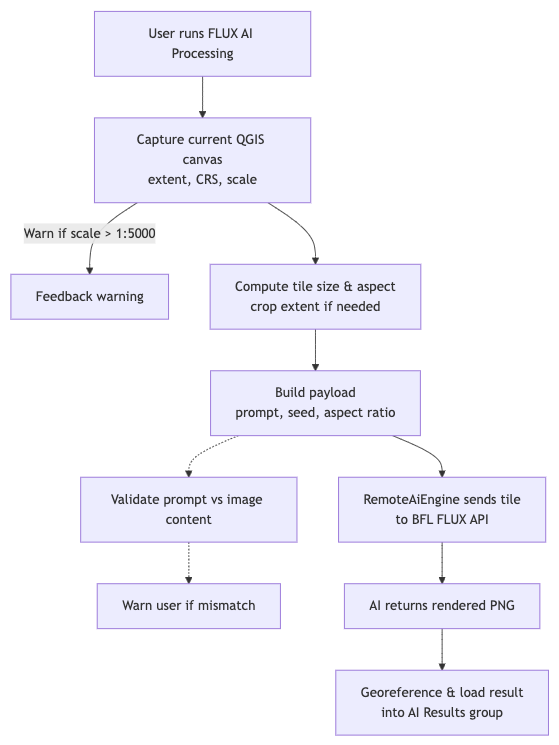

# PromptMap — AI Cartography for QGIS

**PromptMap** is a QGIS Processing plugin that connects your live map canvas to generative AI image APIs. Capture what you see, write a prompt in plain language, and receive a georeferenced GeoTIFF layer back — in seconds.

Supported APIs: **Black Forest Labs** (FLUX.1 Kontext, FLUX 1.1 Ultra, FLUX.2 Editing) and **Google Gemini** (Gemini 3 Pro Image).

## What can you do with it?

Three application modes, all driven by the same prompt-based workflow:

### 1 — Segmentation & Detection

Isolate thematic features — construction sites, vegetation, water bodies — directly from satellite or aerial imagery. The AI understands spatial context and returns a clean, colour-coded mask that can be post-processed into vector polygons.

### 2 — Cartographic Abstraction

Turn raw imagery into a presentation-ready thematic map. Buildings become crisp black solids, roads pop as white lines, green areas turn solid emerald. Adjust the prompt to match your thematic focus.

| Input Canvas (Bing Satellite) | Thematic map (FLUX.1 Kontext) |
| --- | --- |
|  |  |

### 3 — Synthetic Aerial Imagery

Visualise planning scenarios as photorealistic aerial views — add green roofs and PV panels, insert new buildings, remove existing structures, or replace land use. The output is georeferenced and can be fed back into the next iteration.

> **Expert survey (n=35):** Synthetic aerial images were correctly identified as AI-generated in only 53–57 % of cases — near chance level. Source: Staab (2025), *Vom Prompt zum Plan mit GenAI*.

## How it works

1. **PREPARE** — PromptMap renders the visible QGIS canvas to PNG, crops it to the selected tile aspect ratio, and encodes it as base64.
2. **PROCESS** — The image + prompt are sent to the chosen AI API. BFL models use asynchronous polling; Gemini returns inline data directly.
3. **INTEGRATE** — The result is downloaded, watermarked, georeferenced as a GeoTIFF, and loaded as a new raster layer. A GeoPackage with metadata (model, prompt, timestamp, extent) is saved alongside.

## Available models

| Model | Provider | Strength | API key source |
|---|---|---|---|
| **FLUX.1 Kontext [pro]** | Black Forest Labs | Image editing, style transfer, segmentation | <https://api.bfl.ai/> |
| **FLUX 1.1 [pro] Ultra** | Black Forest Labs | High-quality stylisation, raw mode | <https://api.bfl.ai/> |
| **FLUX.2 Image Editing** | Black Forest Labs | 5 model variants (pro / max / flex / klein 4B / klein 9B) | <https://api.bfl.ai/> |
| **Gemini 3 Pro Image** | Google | Multimodal, strong contextual understanding | <https://aistudio.google.com/> |

Full parameter reference: [`docs/flux_models.md`](docs/flux_models.md)  
Official BFL docs: [FLUX.1 Kontext](https://docs.bfl.ai/kontext/kontext_image_editing) · [FLUX 1.1 Ultra](https://docs.bfl.ai/flux/flux_pro)

## Quickstart

1. **Install the plugin**  
   Download the ZIP from GitHub.  
   Open **QGIS → Plugins → Manage and Install… → Install from ZIP**, then enable **PromptMap**.  
   See [docs/install_ZIP.png](docs/install_ZIP.png) for a visual guide.

2. **Get an API key**  
   - BFL models: <https://api.bfl.ai/> (requires FLUX Pro credits)  
   - Gemini: <https://aistudio.google.com/> (Google account required)

3. **Run**  
   Open **Processing Toolbox → PromptMap → Black Forest Labs API** (or **Google Gemini API**), pick a model, paste your API key, write a prompt, and hit **Run**.

After a few seconds the georeferenced layer loads automatically.

## Tile sizes

| Option | Pixels | Use case |
|---|---|---|
| 512×512 | 512 × 512 | Fast preview |
| 1024×1024 | 1024 × 1024 | Default — good balance |
| 2048×2048 | 2048 × 2048 | High detail |
| 1280×720 (16:9) | 1280 × 720 | Widescreen / landscape |
| Map Canvas (Full Extent) | Canvas size | Exact canvas match |

The canvas extent is cropped to match the selected aspect ratio before rendering, so the georeferencing is always pixel-perfect.

## Iterative workflow

PromptMap is designed for iteration. Each run saves `input.png`, `output.png`, `output.tif`, and `output.gpkg` to the chosen output directory. Load the GeoTIFF back as your next input canvas, shift the bounding box to an adjacent tile, and build up a seamless mosaic step by step.

## Troubleshooting

| Symptom | Fix |
|---|---|
| **Hallucinations / wrong content** | Make sure your prompt matches what is visible on the canvas. |
| **401 / Unauthorized** | Check that your API key is valid and has sufficient credits. |
| **Timeout / Task Failed** | Reduce tile size or retry later. |
| **Nothing loads** | Ensure at least one layer is visible on the canvas before running. |
| **Watermark skipped** | `docs/watermark.png` is missing from the plugin folder. |

> **Disclaimer:** PromptMap is an interface between QGIS and external AI APIs. It is not responsible for model outputs. The user is responsible for the image rights of the map canvas content. AI-generated results may contain errors, hallucinations, or cultural biases. Always verify outputs before use in planning or publication contexts.

## Responsible use

- Results are **probabilistic** — identical inputs can produce different outputs.
- Models may reproduce **stereotypes** (e.g. North American settlement patterns in European contexts).
- Cloud inference has **energy and privacy costs** — image data and prompts leave your local system.
- Synthetic aerial images must be **clearly labelled as AI-generated** before publication.

## Support & contact

- Author: Jeroen Staab — email@jstaab.de
- Issues / feature requests: <https://github.com/georoen/qgis-promptmap/issues>
- Onboarding, teaching, and use-case consulting: [Dr. J. Staab Research](https://jstaab.de)

Tag your renders with **#PromptMap** so we can see what you build!
