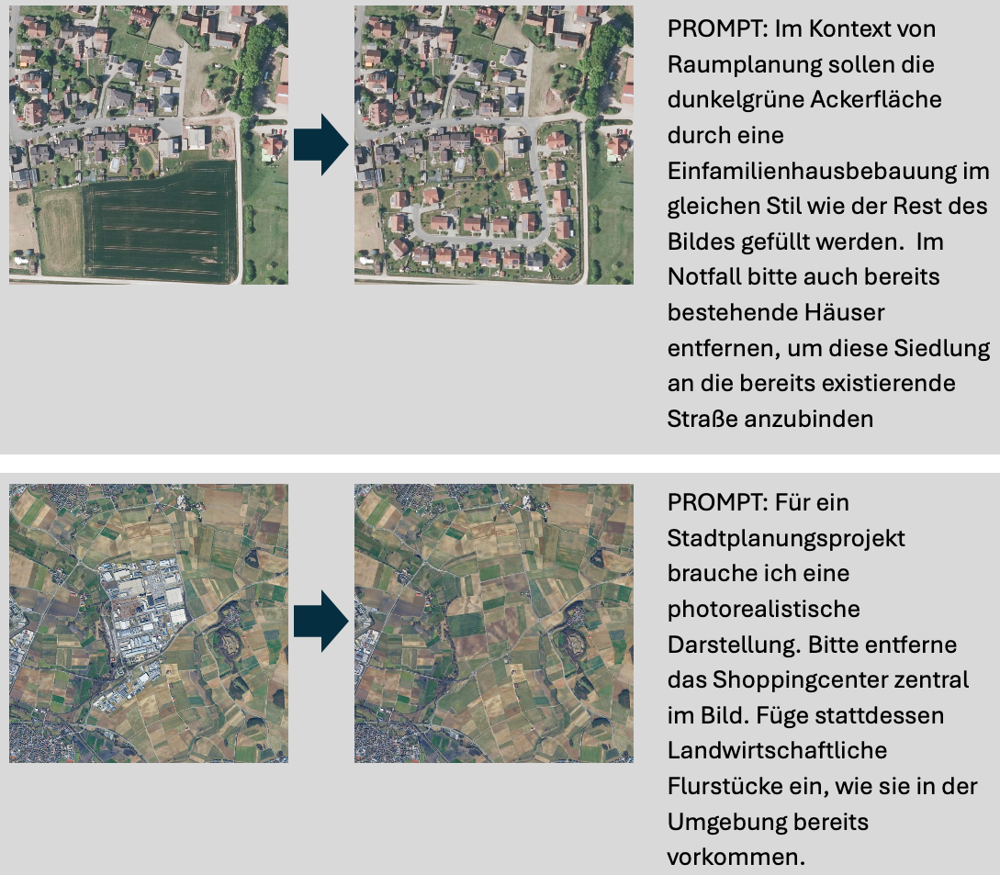
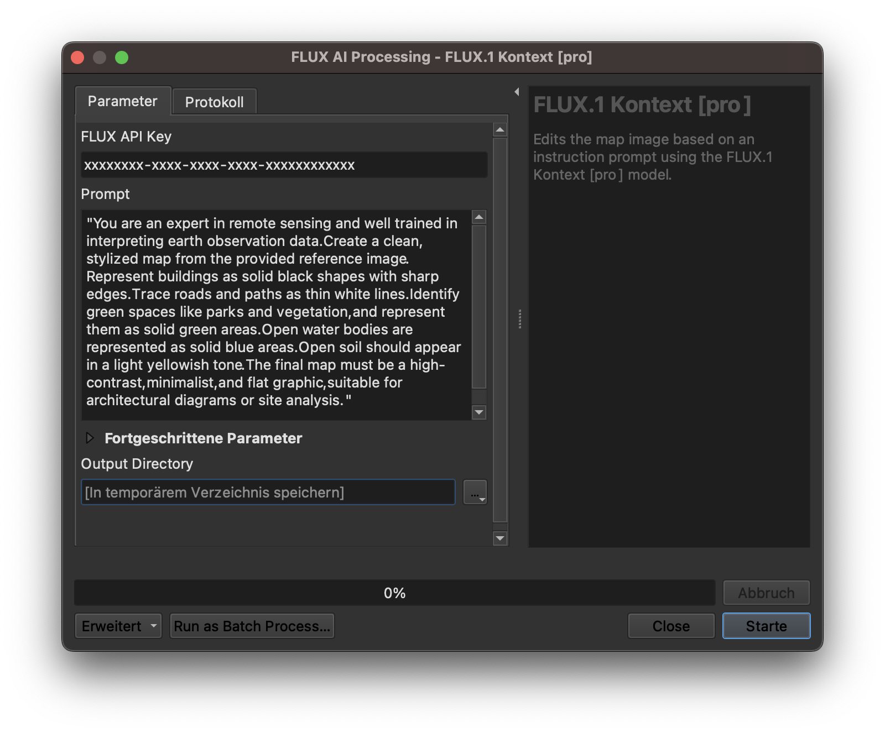

# PromptMap — The PromptMapping Plugin

**PromptMap** is a QGIS Processing plugin that connects your live map canvas to generative AI image APIs. Capture what you see, write a prompt in plain language, and receive a georeferenced GeoTIFF layer back — in seconds.

Supported APIs: **Black Forest Labs** (FLUX.1 Kontext, FLUX 1.1 Ultra, FLUX.2 Editing) and **Google Gemini** (Gemini 3 Pro Image). See [`docs/flux_models.md`](docs/flux_models.md) for the full parameter reference and API documentation links.

## What can you do with it?

Three application modes, all driven by the same prompt-based workflow:

### 1 — Segmentation & Detection

Isolate thematic features — construction sites, vegetation, water bodies — directly from satellite or aerial imagery. The AI understands spatial context and returns a clean, colour-coded mask that can be post-processed into vector polygons.

### 2 — Cartographic Abstraction

Turn raw imagery into a presentation-ready thematic map. Buildings become crisp black solids, roads pop as white lines, green areas turn solid emerald. Adjust the prompt to match your thematic focus.

### 3 — Synthetic Aerial Imagery

Visualise planning scenarios as photorealistic aerial views — add green roofs and PV panels, insert new buildings, remove existing structures, or replace land use. The output is georeferenced and can be fed back into the next iteration.

> **Note on realism:** AI-generated aerial images can look very convincing. For this reason, every output is permanently watermarked with the PromptMap logo. The watermark cannot be removed. Always label AI-generated imagery clearly before sharing or publishing.

## Quickstart

1. **Install the plugin**  
   Download the ZIP from GitHub.  
   Open **QGIS → Plugins → Manage and Install… → Install from ZIP**, then enable **PromptMap**.  
   See [docs/install_ZIP.png](docs/install_ZIP.png) for a visual guide.

2. **Get an API key**  
   PromptMap connects to external AI APIs — you need to register and obtain an API key directly from the respective provider:
   - **Black Forest Labs (FLUX models):** <https://api.bfl.ai/>
   - **Google (Gemini models):** <https://aistudio.google.com/>

   API keys are entered directly in the Processing dialog. Store them via QGIS **Favorites** to avoid re-entering them each time.

   > Need help getting started? Book an onboarding session at [meet.jstaab.de](https://meet.jstaab.de).

3. **Run**  
   Open **Processing Toolbox → PromptMap → Black Forest Labs API** (or **Google Gemini API**), pick a model, paste your API key, write a prompt, and hit **Run**.

After a few seconds the georeferenced layer loads automatically.

## Tile sizes

| Option | Pixels | Use case |
|---|---|---|
| 512×512 | 512 × 512 | Fast preview |
| 1024×1024 | 1024 × 1024 | Default — good balance |
| 2048×2048 | 2048 × 2048 | High detail |
| 1280×720 (16:9) | 1280 × 720 | Widescreen / landscape |
| Map Canvas (Full Extent) | Canvas size | Exact canvas match |

The canvas extent is cropped to match the selected aspect ratio before rendering, so the georeferencing is always pixel-perfect.

## Provenance & metadata

Every run saves four files to the output directory:

| File | Content |
|---|---|
| `input.png` | Rendered QGIS canvas (the input sent to the API) |
| `output.png` | AI result with watermark burned in |
| `output.tif` | Georeferenced GeoTIFF (CRS + bounding box) |
| `output.gpkg` | GeoPackage with model name, prompt, timestamp, and extent polygon |

The GeoPackage provides a traceable record of every generated tile — useful for documentation, reproducibility, and provenance in planning workflows.

## Troubleshooting

| Symptom | Fix |
|---|---|
| **Hallucinations / wrong content** | Make sure your prompt matches what is visible on the canvas. |
| **401 / Unauthorized** | Check that your API key is valid and has sufficient credits. |
| **Timeout / Task Failed** | Reduce tile size or retry later. |
| **Nothing loads** | Ensure at least one layer is visible on the canvas before running. |

## Disclaimer & responsible use

> **PromptMap is provided without warranty of any kind.** The author accepts no liability for the outputs generated by the connected AI models, for any decisions made on the basis of those outputs, or for any direct, indirect, or consequential damages arising from the use of this software.

- PromptMap is an **interface** between QGIS and external AI APIs. It does not control, validate, or guarantee the content of model outputs.
- The **user is solely responsible** for the image rights of the map canvas content forwarded to the API.
- AI-generated results are **probabilistic** — identical inputs can produce different outputs.
- Models may reproduce **cultural stereotypes** or geographic biases.
- Image data and prompts **leave your local system** and are processed on external cloud infrastructure. Review the privacy policies of the respective API providers before use.
- Synthetic aerial images must be **clearly labelled as AI-generated** before sharing or publication.
- PromptMap is not suitable for safety-critical, legal, or regulatory applications without independent expert verification.

## Citation

If you use PromptMap in research or publications, please cite:

> Staab, J. (2026). Vom Prompt zum Plan mit GenAI: Fotorealistische, synthetische Luftbilder im GIS als neues Werkzeug für Stadt- und Landschaftsplanung. *REAL CORP 2026 – 31st International Conference on Urban Planning and Regional Development in the Information Society*, Vienna, Austria, 22–25 March 2026.

## Support & contact

- Author: Jeroen Staab — email@jstaab.de
- Issues / feature requests: <https://github.com/georoen/qgis-promptmap/issues>
- Onboarding, teaching, and use-case consulting: [Dr. J. Staab Research](https://jstaab.de) — book a session at [meet.jstaab.de](https://meet.jstaab.de)

Tag your renders with **#PromptMap** so we can see what you build!
