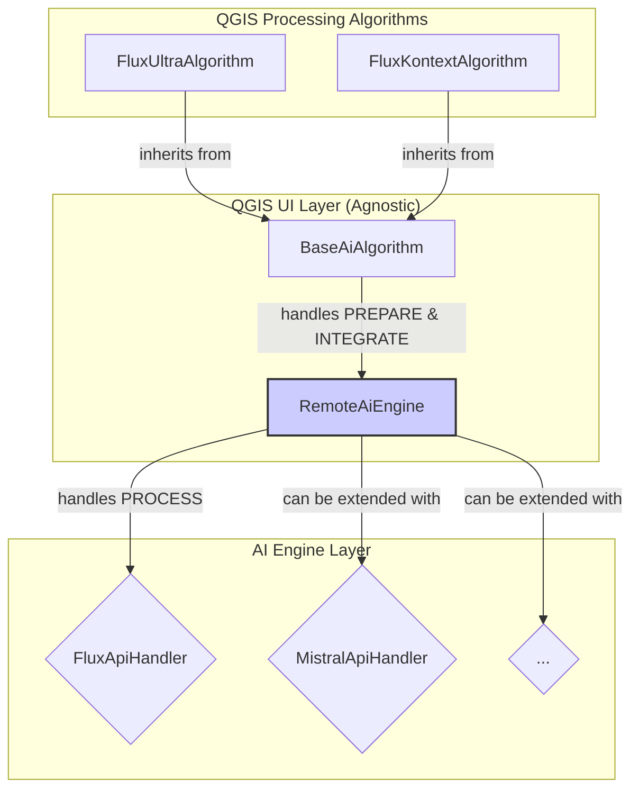

# QGIS FLUX AI Plugin 🗺️✨

**Verwandle deine Karten in Kunstwerke mit FLUX 1.1 [pro] Ultra AI!**

Dieses QGIS-Plugin nutzt die FLUX AI-Technologie, um deine Rasterkarten in stilisierte, künstlerische Visualisierungen zu verwandeln.

---

## 🚀 Schritt-für-Schritt Installation

### 1. Plugin installieren

**Option A: Direkt kopieren (empfohlen)**
```bash
# Terminal öffnen und ausführen:
rm -rf ~/.local/share/QGIS/QGIS3/profiles/default/python/plugins/qgis_flux/
cp -r /Users/jstaab/Desktop/qgis_flux ~/.local/share/QGIS/QGIS3/profiles/default/python/plugins/
```

**Option B: ZIP-Installation**
1. Diesen Ordner als ZIP komprimieren
2. QGIS → Erweiterungen → Erweiterungen verwalten und installieren → "Install from ZIP"

### 2. FLUX API Key besorgen

🔗 **Gehe zu: https://api.bfl.ai/**
1. Account erstellen/einloggen
2. API Key kopieren (beginnt mit `sk-`)
3. **Wichtig:** Du brauchst Guthaben für FLUX 1.1 [pro] Ultra ($0.06 pro Bild)

### 3. QGIS neu starten

**Wichtig:** QGIS komplett schließen und neu öffnen, damit das Plugin erkannt wird.

### 4. Plugin aktivieren

1. QGIS → **Erweiterungen** → **Erweiterungen verwalten**
2. **"Installierte"** Tab
3. ✅ **"qgis_flux"** aktivieren

### 5. Plugin finden und nutzen

1. **Processing Toolbox** öffnen (View → Panels → Processing Toolbox)
2. **"FLUX AI Processing"** Gruppe finden
3. **"FLUX Stylize Tiles"** doppelklicken

---

## 🎯 Erste Verwendung

### Parameter eingeben:

| **Parameter** | **Was eintragen** | **Beispiel** |
|---------------|-------------------|---------------|
| **Input Raster Layer** | Deine Rasterkarte auswählen | OpenStreetMap, Satellitenbild |
| **FLUX API Key** | Dein API Key einfügen | `sk-abc123xyz...` |
| **Style Prompt** | Gewünschten Stil beschreiben | `watercolor painting` |
| **Tile Size** | Bildgröße wählen | `1024×1024` (bessere Qualität) |
| **Output Directory** | Ordner für Ergebnisse | `/Users/jstaab/Desktop/flux_output/` |
| **Output Format** | Bildformat | `PNG` (mit Transparenz) |
| **Create VRT** | ✅ Mosaik erstellen | Für nahtlose Darstellung |

### **RUN** klicken → Fertig! 🎉

---

## 🎨 Kreative Style-Prompts

```
"watercolor landscape painting with soft brush strokes"
"cyberpunk cityscape with neon lights and dark atmosphere"  
"hand-drawn medieval fantasy map with aged parchment texture"
"satellite view in infrared false color"
"black and white pencil sketch with cross-hatching"
"Van Gogh style oil painting with swirling brushstrokes"
"retro 80s synthwave aesthetic with pink and blue gradients"
"impressionist painting of autumn forest"
"aerial photography with high contrast and dramatic lighting"
"ancient cartographer style with decorative borders"
```

---

## 📁 Was passiert?

### Ausgabe-Dateien:
```
/dein/ausgabe/ordner/
├── flux_tile_000_000.png      # 🎨 Stylisierte Kachel  
├── flux_tile_000_000.pgw      # 🌍 World-File (Georeferenz)
├── flux_stylized_mosaic.vrt   # 🗂️ Mosaik aller Kacheln
└── flux_processing.log        # 📋 Verarbeitungsprotokoll
```

### Automatisch passiert:
1. **Kachelung:** Deine Karte wird in quadratische Stücke geteilt
2. **FLUX AI:** Jede Kachel wird mit deinem Stil verschönert  
3. **Georeferenzierung:** World-Files sorgen für korrekte Positionierung
4. **QGIS-Integration:** VRT wird automatisch als Layer geladen

---

## 🔧 Problemlösung

### ❌ "Plugin kann nicht geladen werden"

**Lösung:**
```bash
# Plugin komplett neu installieren
rm -rf ~/.local/share/QGIS/QGIS3/profiles/default/python/plugins/qgis_flux/
cp -r /path/zu/qgis_flux ~/.local/share/QGIS/QGIS3/profiles/default/python/plugins/
```
**Dann QGIS neu starten!**

### ❌ "API Key Error 401"
- API Key korrekt kopiert? (beginnt mit `sk-`)
- Guthaben auf Konto vorhanden?
- Internet-Verbindung OK?

### ❌ "Timeout" oder "Failed"
- Netzwerk langsam → längere Tiles nehmen mehr Zeit
- Server überlastet → später versuchen
- Details in `flux_processing.log` prüfen

### ❌ "No VRT created"
- GDAL fehlt (nicht kritisch - Tiles funktionieren trotzdem)
- Einzelne PNG-Dateien manuell laden

### 🏃‍♂️ Performance-Tipps
- **Start klein:** Erst kleine Testgebiete (z.B. 1km²)
- **Tile-Größe:** 512×512 ist schneller, 1024×1024 bessere Qualität
- **Format:** PNG für Transparenz, JPEG für Speed

---

## 🌟 Erweiterte Funktionen

### Demo-Modus (ohne API)
```bash
export FLUX_DEMO_MODE=true
# Plugin funktioniert ohne echte API-Calls für Tests
```

### Batch-Verarbeitung
- Mehrere Karten → einzeln verarbeiten
- Verschiedene Stile → unterschiedliche Prompts testen
- Seeds → `42` für reproduzierbare Ergebnisse

### API-Kosten optimieren  
- **FLUX Ultra:** $0.06 per 4MP Bild
- **Tipp:** Kleine Testbereiche zuerst, dann große Projekte
- **Rechnung:** 10 Kacheln = ~$0.60

---

## ⚙️ Technische Details

### System-Anforderungen
- **QGIS:** 3.20+ (getestet mit 3.42)
- **Python:** 3.9+ mit requests
- **Internet:** Für FLUX API-Zugriff
- **Optional:** GDAL für VRT

### API-Compatibility  
- **Verwendet:** FLUX 1.1 [pro] Ultra mit Image-to-Image
- **Endpoint:** `https://api.bfl.ai/v1/flux-pro-1.1-ultra`
- **Features:** `image_prompt`, `image_prompt_strength`, Polling-Workflow

### Datensicherheit
- API Keys werden **niemals** geloggt
- Requests über HTTPS verschlüsselt
- Kein Caching von API-Antworten
- Lokale Verarbeitung der Karten

---

## 🧪 Entwicklung & Tests

```bash
# Tests ohne QGIS/FLUX ausführen
python -m pytest tests/ -v

# Core-Funktionen testen
python -c "import flux_stylize_tiles; print('✅ Import funktioniert')"

# Plugin-Struktur validieren
ls -la qgis_flux/
```

---

## 📞 Support & Community

### Erste Hilfe
1. **Log-Datei prüfen:** `flux_processing.log` zeigt Details
2. **Plugin neu installieren** (siehe oben)
3. **QGIS neu starten** nach Plugin-Änderungen

### Häufige Fragen
- **"Warum dauert es so lange?"** → FLUX AI braucht Zeit für Qualität
- **"Kostet das Geld?"** → Ja, $0.06 pro stylisierter Kachel
- **"Kann ich offline arbeiten?"** → Nein, FLUX API benötigt Internet

---

## 🎉 Viel Spaß!

**Du hast jetzt alles, um beeindruckende AI-stylisierte Karten zu erstellen!**

Teile deine Kreationen, experimentiere mit verschiedenen Prompts, und verwandle deine GIS-Daten in echte Kunstwerke.

---

*Plugin erstellt für QGIS 3.x mit ❤️ und FLUX AI*

---

## 🔮 Future Development & Refactoring

To support a wider range of AI APIs beyond FLUX (e.g., Mistral, Gemini) and to make the codebase more modular and maintainable, a major refactoring is planned.

### Core Architecture Vision

The plugin will be restructured to clearly separate QGIS-specific logic from the AI processing logic. The core principle is a three-step data flow: `PREPARE` -> `PROCESS` -> `INTEGRATE`.

1.  **`PREPARE`**: Render the current QGIS map canvas into an image tile.
2.  **`PROCESS`**: Send the image and a prompt to a selected remote AI service.
3.  **`INTEGRATE`**: Georeference the resulting image and load it back into QGIS.

### Planned Class Structure



-   **`BaseAiAlgorithm`**: A new base class for all QGIS Processing algorithms in this plugin. It will contain all the shared logic for handling the QGIS map canvas (`PREPARE`) and loading the results (`INTEGRATE`).
-   **`RemoteAiEngine`**: This class (formerly `FluxStylizeTiles`) will act as a generic, agnostic engine for remote AI processing. Its sole responsibility is to manage API communication (`PROCESS`). It will take an image and a prompt, and return a processed image.
-   **API Handlers**: For each specific service (like FLUX Ultra, FLUX Kontext, Mistral), a dedicated handler class or method will be implemented within the `RemoteAiEngine`.
-   **QGIS Algorithms**: The user-facing algorithms (`FluxUltraAlgorithm`, `FluxKontextAlgorithm`) will become very lightweight, inheriting from `BaseAiAlgorithm` and simply specifying which API configuration to use.

This refactoring will pave the way for easy integration of new AI services while keeping the core logic clean and centralized.