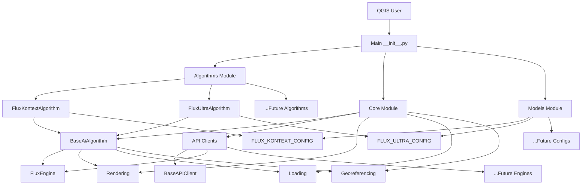

# PromptMap Architecture — Detailed Explanation

## Architecture Overview



## Key Components Explained

### 1. Base Algorithm (Boilerplate) - `core/algorithm.py`

**This is the boilerplate/abstract base class** that contains all the common functionality:

```python
class BaseAiAlgorithm(QgsProcessingAlgorithm):
    # Common UI parameters (API key, tile size, output dir, etc.)
    # Common processing logic (render → process → integrate)
    # Common methods (get_engine, processAlgorithm, etc.)
    
    @property
    def api_config(self) -> ApiConfig:
        # Subclasses must implement this to provide their specific config
        raise NotImplementedError()
    
    def get_api_specifics(self, parameters, context):
        # Subclasses must implement this to provide API-specific params
        raise NotImplementedError()
```

**This is NOT the Gemini implementation** - it's the shared foundation that both Flux and Gemini (and future APIs) will use.

### 2. Specific Algorithm Implementations - `algorithms/`

These are the concrete implementations that QGIS actually uses:

```python
# algorithms/flux_kontext.py
class FluxKontextAlgorithm(BaseAiAlgorithm):
    PROMPT = "PROMPT"
    SAFETY = "SAFETY"
    
    @property
    def api_config(self):
        return FLUX_KONTEXT_CONFIG  # From models/
    
    def initAlgorithm(self):
        # Add Flux Kontext specific UI parameters
        super().initAlgorithm()
        self.addParameter(QgsProcessingParameterString(self.PROMPT, ...))
        self.addParameter(QgsProcessingParameterNumber(self.SAFETY, ...))
    
    def get_api_specifics(self, parameters, context):
        # Extract Flux Kontext specific parameters
        prompt = self.parameterAsString(parameters, self.PROMPT, context)
        safety = self.parameterAsInt(parameters, self.SAFETY, context)
        
        return "flux_kontext_result.png", {
            "prompt": prompt,
            "safety_tolerance": safety
        }
```

### 3. Where is Gemini?

**Gemini is NOT implemented yet** in the new structure, but here's where it would go:

```
# Future: algorithms/gemini.py
class GeminiAlgorithm(BaseAiAlgorithm):
    PROMPT = "PROMPT"
    # Gemini specific parameters would go here
    
    @property
    def api_config(self):
        return GEMINI_CONFIG  # From models/gemini.py
    
    def get_engine(self, api_key, log_path):
        from core.api.gemini import GeminiEngine
        return GeminiEngine(api_key, log_path)
    
    # ... rest of Gemini-specific implementation
```

And the Gemini engine would be:

```
# Future: core/api/gemini.py
class GeminiEngine(BaseAPIClient):
    # Gemini-specific API communication
    # Would inherit from BaseAPIClient for common functionality
    # But implement Gemini-specific request/response handling
```

## Current Status

### What's Implemented Now (Phase 1)

✅ **Base Algorithm (Boilerplate)**: `core/algorithm.py`
✅ **Flux Kontext Algorithm**: `algorithms/flux_kontext.py`
✅ **Flux Ultra Algorithm**: `algorithms/flux_ultra.py`
✅ **Flux API Engine**: `core/api/flux.py`
✅ **Base API Client**: `core/api/base.py` (foundation for future APIs)
✅ **Models**: `models/flux_kontext.py`, `models/flux_ultra.py`
✅ **Utilities**: Rendering, loading, georeferencing, geometry

### What's NOT Implemented Yet

❌ **Gemini Algorithm**: Not created yet (was incomplete in original code)
❌ **Gemini API Engine**: Not created yet
❌ **Gemini Model Config**: Not created yet

## Why This Architecture is Better

### Before (Old Structure)
```
PROCESS/
├── flux/
│   ├── engine.py        # Flux-specific
│   ├── config.py        # Flux config
│   └── kontext_algorithm.py  # Flux Kontext algorithm
├── gemini/
│   ├── engine.py        # Gemini-specific (incomplete)
│   ├── config.py        # Gemini config
│   └── algorithm.py     # Gemini algorithm (incomplete)
```

### After (New Structure)
```
core/
├── algorithm.py         # SHARED base algorithm (boilerplate)
├── api/
│   ├── base.py          # SHARED base API client
│   └── flux.py          # Flux-specific engine

algorithms/
├── flux_kontext.py     # Flux Kontext algorithm
└── flux_ultra.py       # Flux Ultra algorithm

models/
├── flux_kontext.py     # Flux Kontext config
└── flux_ultra.py       # Flux Ultra config
```

## Key Benefits

1. **Shared Boilerplate**: Common code in `BaseAiAlgorithm` used by all algorithms
2. **Easy to Add New APIs**: Just create new files in `algorithms/` and `models/`
3. **Clean Separation**: Core logic vs. API-specific implementations
4. **Better Organization**: Logical grouping by function
5. **Preserved Functionality**: All existing features maintained

## Gemini Implementation Plan

When you're ready to add Gemini, we would:

1. **Create `models/gemini.py`**: Define Gemini configuration
2. **Create `core/api/gemini.py`**: Implement Gemini API communication
3. **Create `algorithms/gemini.py`**: Implement Gemini algorithm
4. **Update main `__init__.py`**: Export the new algorithm

This would take about 1-2 hours and follow the exact same pattern as Flux.

## Summary

- **Base Algorithm** = Boilerplate/abstract class in `core/algorithm.py`
- **Gemini** = Not implemented yet, but has a clear place in the architecture
- **Current Implementation** = Flux Kontext & Ultra fully working, Gemini ready to add
- **Architecture** = Much cleaner, easier to maintain, simpler to extend