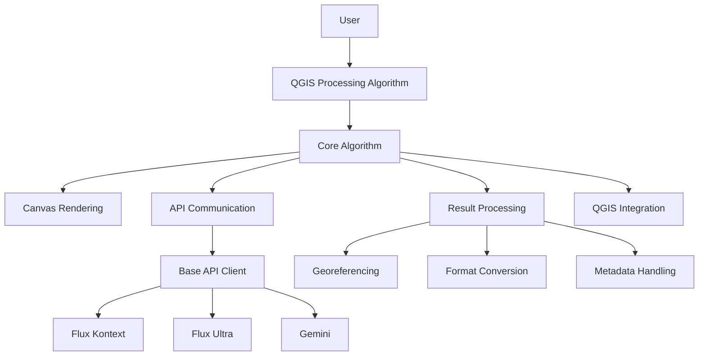

# QGIS FLUX Refactoring Plan

## Current Issues Analysis

### 1. Overly Complex Structure
- Current: `PREPARE/`, `PROCESS/`, `INTEGRATE/` subdirectories with deep nesting
- Problem: Hard to navigate, understand relationships, and maintain
- Solution: Flatten to logical modules

### 2. Code Duplication
- Multiple engine implementations (FluxEngine, GeminiEngine) with ~80% identical code
- Redundant configuration patterns
- Solution: Unified base API client with model-specific extensions

### 3. Legacy and Unused Code
- Gemini implementation appears incomplete
- Some utility functions may be unused
- Solution: Remove unused code, document what's essential

### 4. Naming Issues
- Some class/function names are misleading or unclear
- Inconsistent naming conventions
- Solution: Clear, descriptive names following Python conventions

## Proposed Architecture

## Migration Steps

### Phase 1: Core Refactoring
1. **Create new core structure**
   - `core/algorithm.py` - Base algorithm class
   - `core/api/` - Unified API communication
   - `core/rendering.py` - Canvas rendering
   - `core/loading.py` - Result loading

2. **Implement unified API base class**
   - Single base class with common functionality
   - Model-specific implementations inherit from base
   - Consistent interface for all APIs

### Phase 2: Code Migration
1. Move existing functionality to new structure
2. Update imports and references
3. Remove redundant code
4. Clean up naming

### Phase 3: Testing
1. Update existing tests
2. Add new tests for refactored components
3. Manual testing in QGIS

### Phase 4: Documentation
1. Update README with new structure
2. Update contribution guidelines
3. Add architecture documentation

## Benefits of New Architecture

1. **Easier Maintenance**: Clear structure, less duplication
2. **Better Extensibility**: Simple to add new API endpoints
3. **Improved Readability**: Descriptive names, logical organization
4. **Reduced Complexity**: Flatter structure, fewer nested directories
5. **Better Testing**: Clearer separation of concerns

## Risk Assessment

### Low Risk
- Naming changes (can be done incrementally)
- Directory restructuring (tooling can help)
- Removing unused code (careful analysis first)

### Medium Risk
- Unified API interface (need thorough testing)
- Import path changes (may break existing code temporarily)

### High Risk
- Major logic changes (should be avoided during refactoring)
- Breaking public API (need version compatibility)

## Recommendation

Start with a conservative approach:
1. Create new structure alongside existing code
2. Gradually migrate functionality
3. Test at each step
4. Remove old code only when new code is proven working

This allows for safe, incremental improvement without breaking existing functionality.